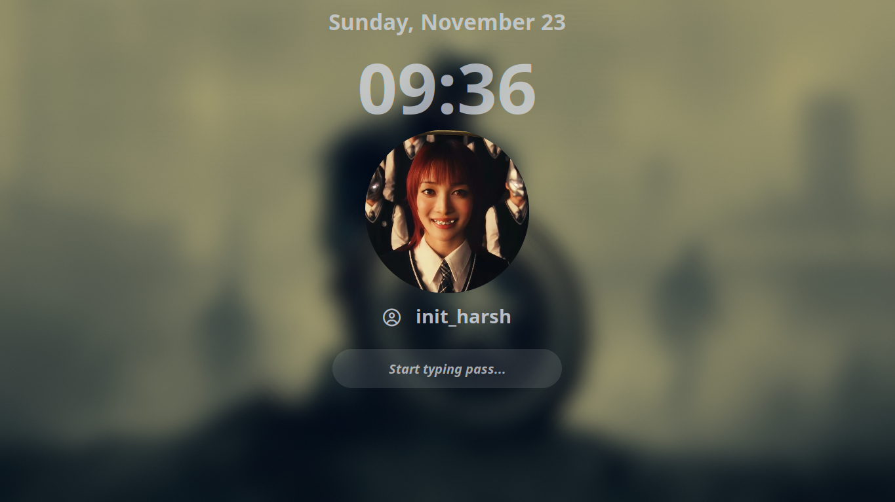
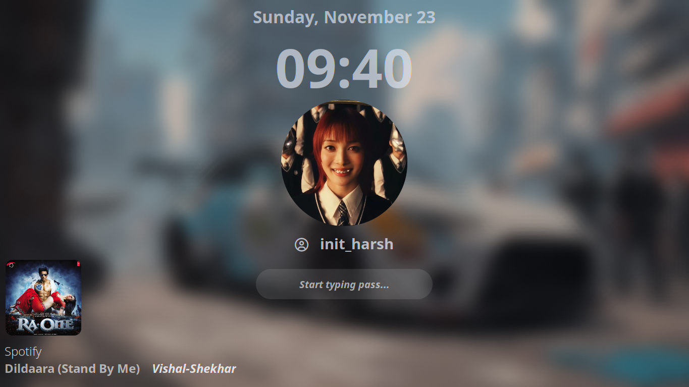
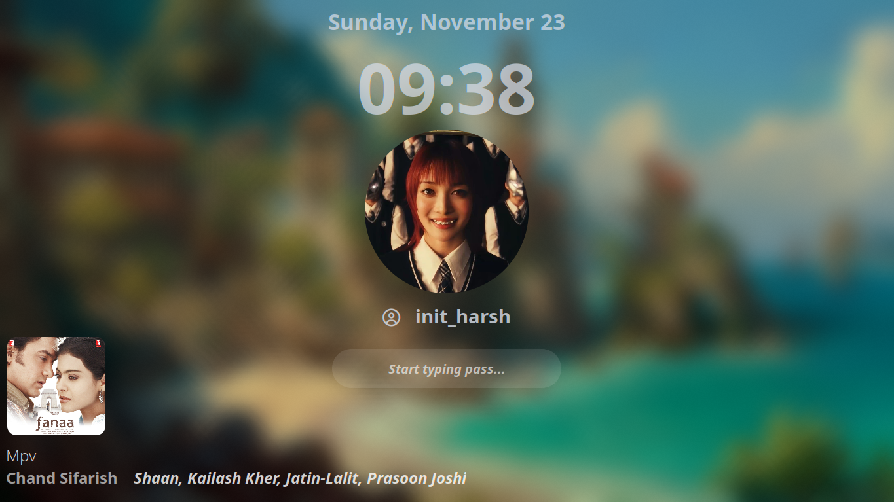

# Now-Playing for Hyprlock
Display currently playing music on your Hyprlock lock screen with album-art and play-pause toogle.

## Features

- Displays currently playing track info
- Shows album artwork
- Automatic fallback for missing album-art
- Play/pause toggle from lock screen

## Preview

| | | 
|---|---|
| **Clean look when nothing is playing**  | **Spotify**  | 
| **Local Player**  | **Browser**  |

---
NOTE! the script isn't slow or lagging the delay in display of `play-pause` is because of this line in `hyprlock.conf`
```
text = cmd[update:1000] echo "$(~/.config/hypr/nowplaying/nowplaying.sh)"

change the update time to small like 100 then it will update instantly
```
https://github.com/user-attachments/assets/d10c6794-013b-430c-924f-6708fa3ed077

## Installation
> [!CAUTION]
> The bash script is configured to use `~/.config/hypr/nowplaying` as default path. So, you can use the suggested installation step or modify it as needed.
```
# --- Configuration ---
art_file="$HOME/.config/rofi/nowplaying/album_art.png"
fallback_art_file="$HOME/.config/rofi/nowplaying/fallback_album_art.png"
cache_file="$HOME/.config/rofi/nowplaying/song_title.cache"
```

1. Create the required directories:
```
mkdir -p ~/.config/hypr/nowplaying
```
2. Clone this repository:
```
git clone https://github.com/Harsh-bin/hyprlock-nowplaying ~/.config/hypr/nowplaying
```
3. Make script executable
```
chmod +x ~/.config/hypr/nowplaying/nowplaying.sh
```

**Quick-Tip**

Try to run `nowplaying.sh` before `hyprlock`.

---

Also check [Rofi-nowplaying](https://github.com/Harsh-bin/rofi-music-control) based on this script.


## Author ✍️

Created by [Harsh-bin](https://github.com/Harsh-bin)

---
**Enjoy! 🎉**
